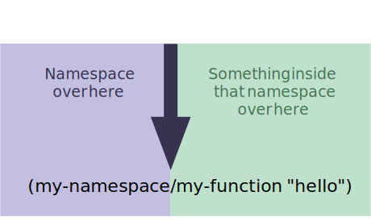

One of the first hurdles I encountered as I got into ClojureScript was the distinction between require and import. It's a little muddy at first. Here are some tips on keeping the two separate in your head.

<span class="more"></span>

## namespaces in ClojureScript

<div class="callout addendum">
This section is the "why" behind all this, don't care? <a href="#require-is-about-namespaces">head on to the next section</a>
</div>

The trick to ClojureScript namespaces is they are actually Google Closure namespaces. Closure namespaces are both very straightforward and a little bit magical.

### goog.provide
`goog.provide('foo.bar')` creates the Closure namespace `foo.bar`. `provide` does not do anything fancy at all, it simply ensures plain jane JavaScript objects exist or are created at `[global].foo.bar`, just like any other JavaScript namespace system out there. The magic behind this function is that Closure build tools scan files looking for calls to goog.provide, and that influences how the Closure compiler builds your code.

### goog.require

`goog.require('foo.bar')` ensures that the foo.bar namespace is available and usable from your file. If you are running your code with optimizations set to none, then `goog.require` will create a new script tag and load the JS file corresponding to the namespace. If you're in Node.js, then `goog.require` will do a standard Node `require()` call instead.


## require is about namespaces

`require` *always* brings other namespaces into your file. Always. The key to namespaces in ClojureScript is `/`, the forward slash is the divider between a namespace and a symbol in that namespace.



That's painfully obvious, but if you just remember "require means namespace" it really de-mudifies all of this a lot.

### :refer

When you use `:refer` with require, it's still about namespaces, just the namespace part becomes implicit.

```clojure
(ns demo
  (:require [foo :refer [bar]]))

;; the compiler turns this back
;; into (foo/bar ...) for you.
(bar "invoke bar")
```

## import is about JavaScript

import brings "some JavaScript thing" into your file. It's a looser way to refer to things and it's rarely needed. That "JavaScript thing" has to still be found in a namespace.


## Closure namespaces bring in the mud


```clojure
(ns demo
  (:require [goog.net.XhrIo]))
